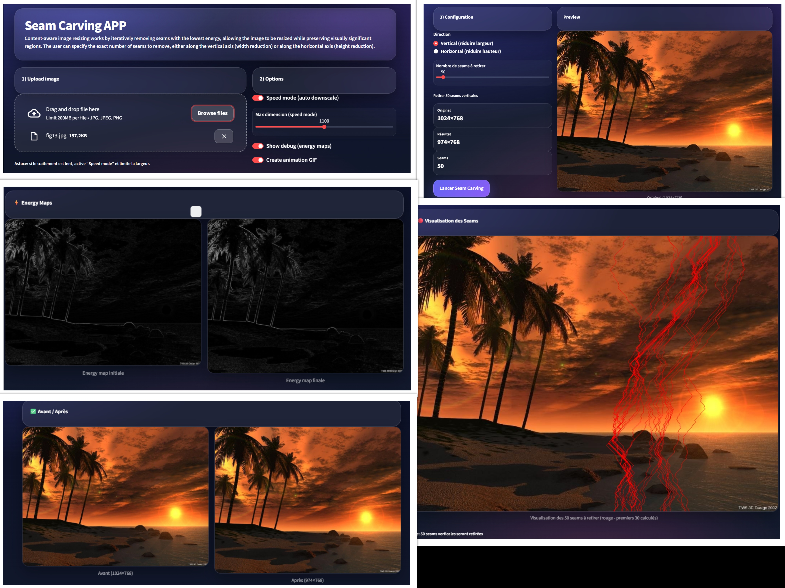
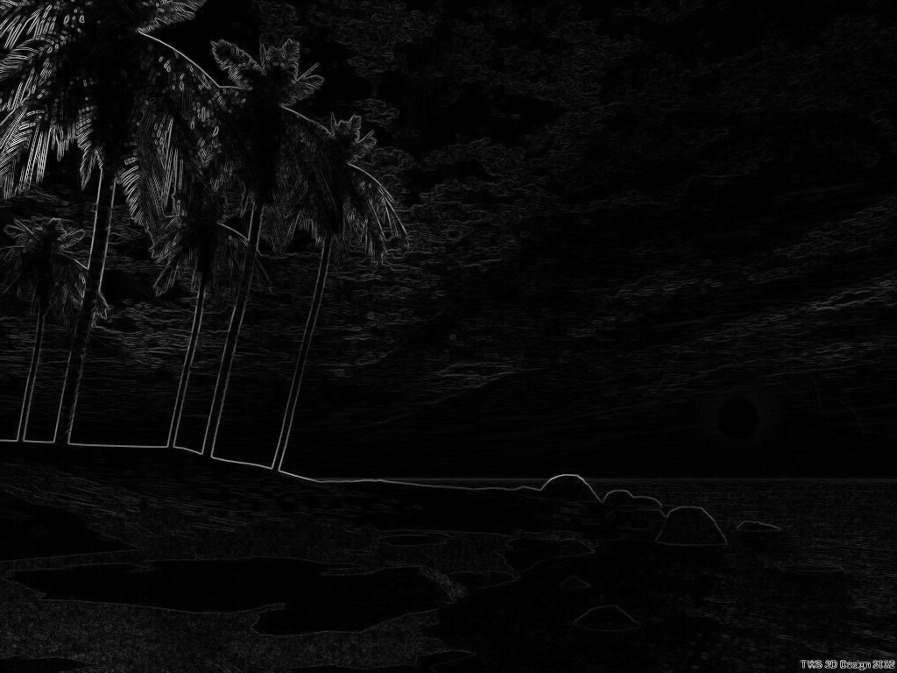
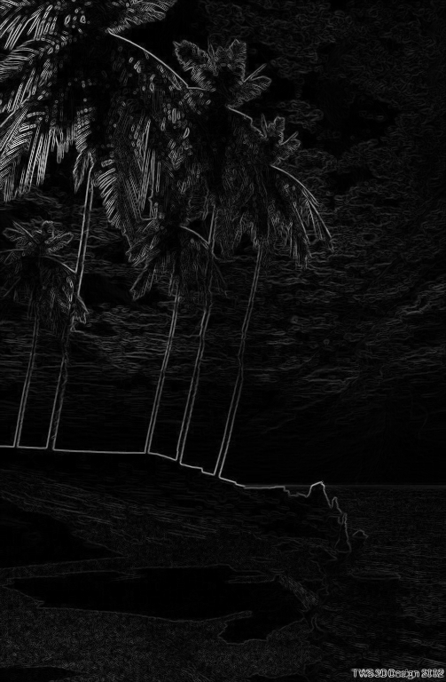
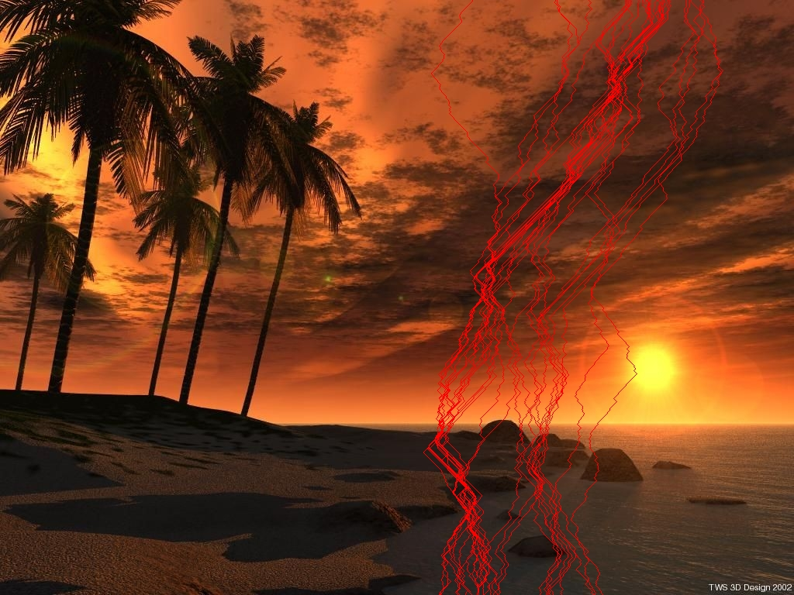
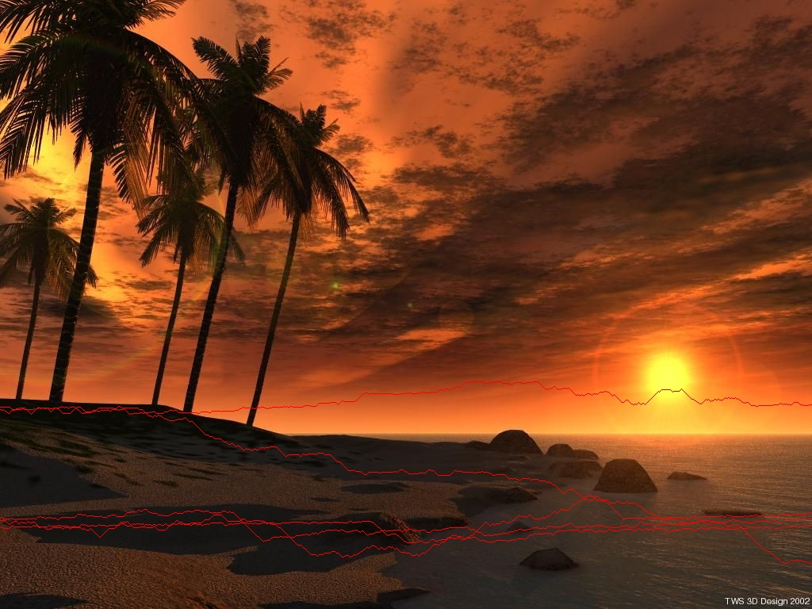

# Seam Carving Image Resizing

## Project Date

**January 2026**

## Overview

This project implements the **Seam Carving** algorithm for content-aware image resizing. Unlike traditional resizing methods that scale the entire image uniformly, Seam Carving removes low-energy pixel paths while preserving visually important structures.

The project includes a complete implementation in Python using **NumPy** and **Pillow**, along with an interactive **Streamlit application** that allows users to upload an image, visualize energy maps, display seams, and compare before/after resizing results.

## Project Context

Image resizing is a common operation in computer vision and digital media. However, standard resizing can distort important objects, while cropping may remove relevant visual regions.

Seam Carving addresses this problem by identifying and removing connected paths of pixels called **seams**. These seams pass through low-energy regions, allowing the image to be resized while preserving important visual content.

This project investigates the following question:

> How can graph algorithms and dynamic programming be used to resize images intelligently while preserving important visual structures?

## Algorithmic Approach

The image is modeled as a **Directed Acyclic Graph (DAG)**:

* Each pixel is represented as a node.
* Edges connect each pixel to its possible next neighbors.
* Each edge is weighted by the energy of the destination pixel.
* The optimal seam corresponds to the shortest path in this graph.

The algorithm uses dynamic programming to compute the minimum cumulative energy path.

## Features

* Upload an image through a Streamlit interface
* Convert RGB images to grayscale
* Compute energy maps based on image gradients
* Detect vertical seams
* Detect horizontal seams
* Remove low-energy seams
* Visualize seams on the original image
* Display before/after resizing results
* Generate visual animations of the resizing process

## Methodology

The project follows these main steps:

1. Load and convert the input image
2. Convert the image to grayscale
3. Compute the energy map
4. Build the cumulative energy map
5. Find the optimal vertical or horizontal seam
6. Remove the selected seam
7. Repeat the process until the target size is reached
8. Display the resized image and visual outputs

## Seam Carving Pipeline

```text
Input Image
    ↓
Grayscale Conversion
    ↓
Energy Map Computation
    ↓
Cumulative Energy Map
    ↓
Minimum-Energy Seam Detection
    ↓
Seam Removal
    ↓
Content-Aware Resized Image
```

## Visual Results

### Streamlit Application Interface



### Energy Map Examples





### Vertical Seam Removal



### Horizontal Seam Removal



### Result Preview


## Project Structure

```text
seam-carving-image-resizing/
│
├── README.md
├── requirements.txt
├── .gitignore
│
├── app/
│   └── app.py
│
├── reports/
│   └── seam_carving_report.pdf
│
├── images/
│   ├── app_interface.jpg
│   ├── energy_map_1.jpg
│   ├── energy_map_2.jpg
│   ├── vertical_seam.jpg
│   ├── horizontal_seam.jpg
│   └── result_preview.gif
│
└── media/
    ├── seam_animation.gif
    └── seam_animation.avi
```

## How to Run

### 1. Clone the repository

```bash
git clone https://github.com/arefbakali/seam-carving-image-resizing.git
cd seam-carving-image-resizing
```

### 2. Create a virtual environment

```bash
python -m venv .venv
```

### 3. Activate the environment

On Windows:

```bash
.venv\Scripts\activate
```

On macOS/Linux:

```bash
source .venv/bin/activate
```

### 4. Install dependencies

```bash
pip install -r requirements.txt
```

### 5. Run the Streamlit application

```bash
streamlit run app/app.py
```

## Requirements

Main libraries used:

* Python
* Streamlit
* NumPy
* Pillow

## Technical Details

The application implements:

* RGB to grayscale conversion
* Gradient-based energy function
* Vertical seam detection
* Horizontal seam detection
* Cumulative energy map computation
* Seam backtracking
* Seam removal
* Seam visualization
* GIF generation for result preview

## Key Takeaways

* Seam Carving can resize images while preserving visually important regions.
* The problem can be modeled as a shortest-path problem in a Directed Acyclic Graph.
* Dynamic programming provides an efficient way to compute optimal seams.
* Energy maps help identify low-importance areas in the image.
* Streamlit makes the algorithm interactive and easy to test visually.

## Limitations

* The method works best when low-energy regions are available.
* Images with dense important objects may suffer from visual artifacts.
* Removing too many seams can distort the image.
* The current implementation focuses on seam removal, not object-aware protection masks.

## Future Improvements

* Add object protection masks
* Add object removal functionality
* Add seam insertion for image enlargement
* Add side-by-side animation controls
* Improve energy function using advanced gradient operators
* Deploy the Streamlit app online

## Author

**Aref Bak Ali**<br>
AI, Data Science & Agentic AI Student<br>
GitHub: https://github.com/arefbakali<br>
LinkedIn: https://linkedin.com/in/aref-bak-ali/
